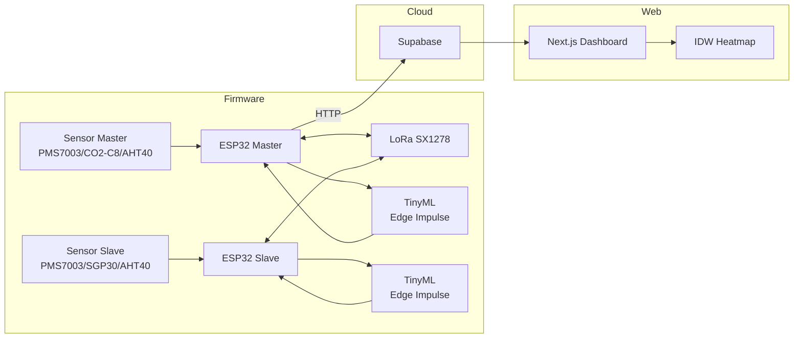

# Flow chart tong quan he thong

```mermaid
flowchart LR
    subgraph Firmware
        M[ESP32 Master]
        S[ESP32 Slave]
        SENS_M[Sensor Master\nPMS7003/CO2-C8/AHT40]
        SENS_S[Sensor Slave\nPMS7003/SGP30/AHT40]
        LORA[LoRa SX1278]
        ML_M[TinyML\nEdge Impulse]
        ML_S[TinyML\nEdge Impulse]
    end

    subgraph Cloud
        DB[Supabase]
    end

    subgraph Web
        WEB[Next.js Dashboard]
        IDW[IDW Heatmap]
    end

    SENS_M --> M
    SENS_S --> S
    M <--> LORA
    S <--> LORA
    M --> ML_M
    S --> ML_S
    ML_M --> M
    ML_S --> S
    M -->|HTTP| DB
    DB --> WEB
    WEB --> IDW
```
