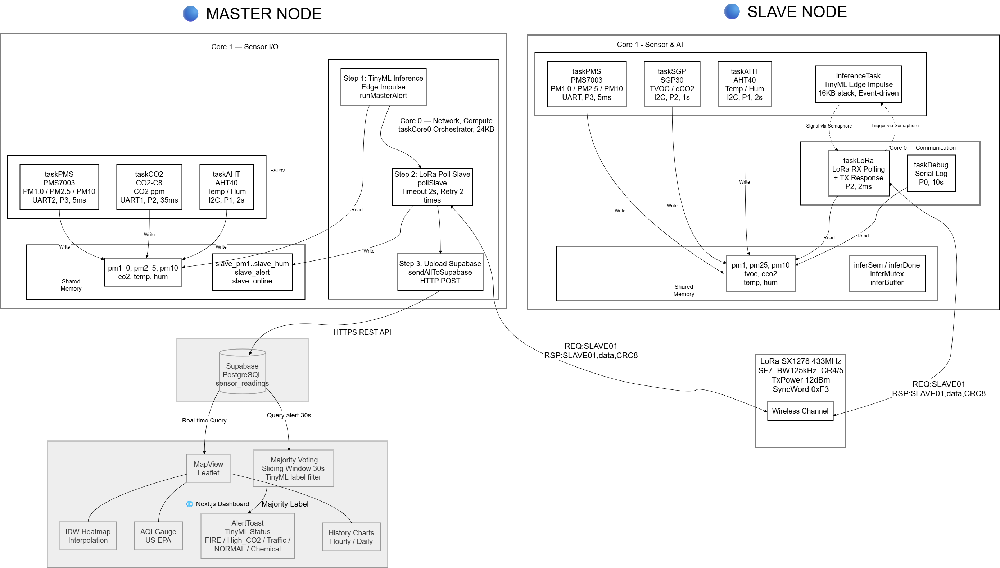
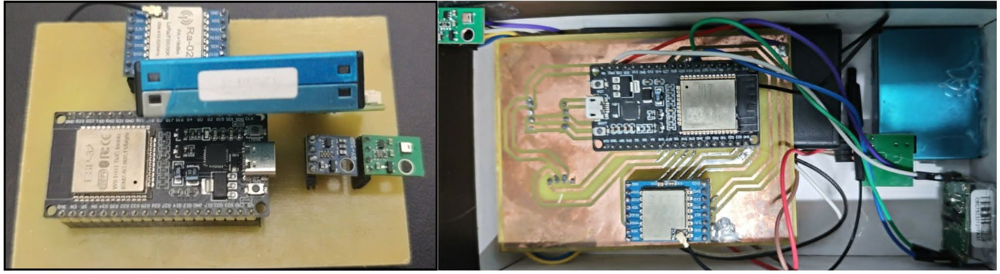
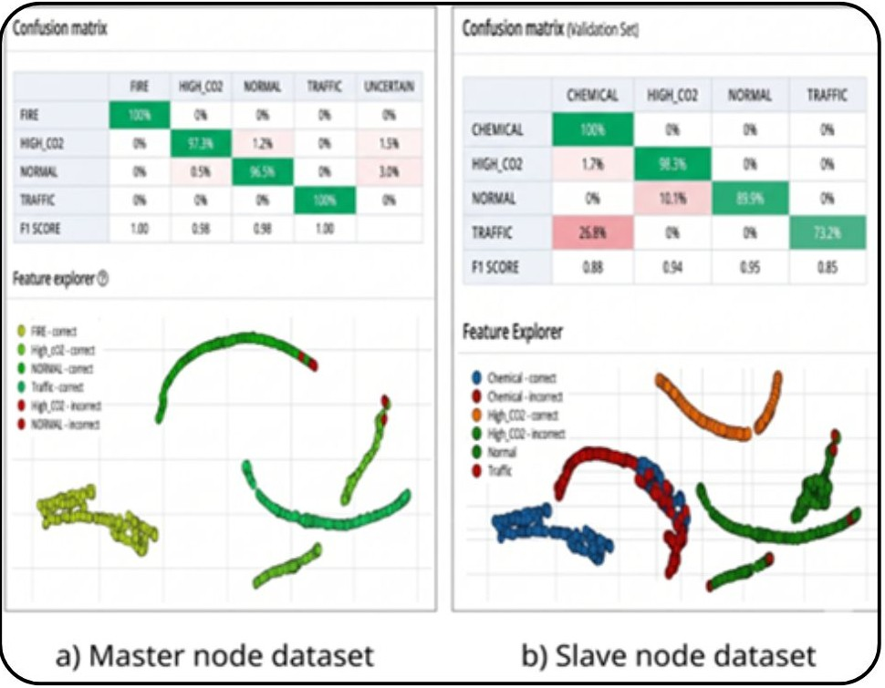
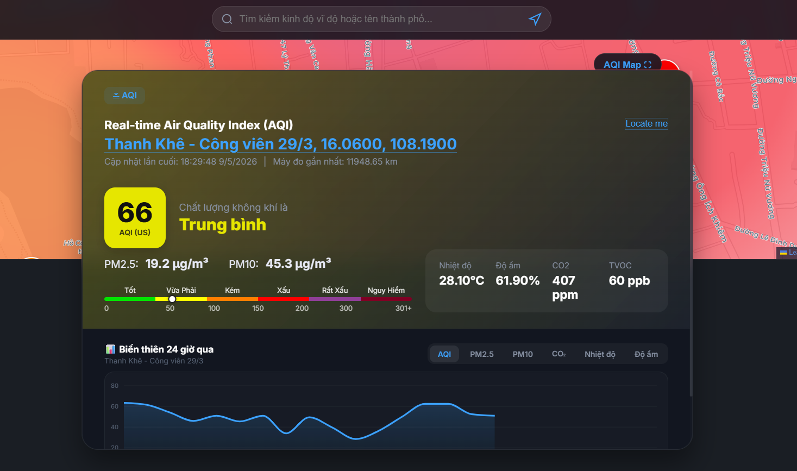
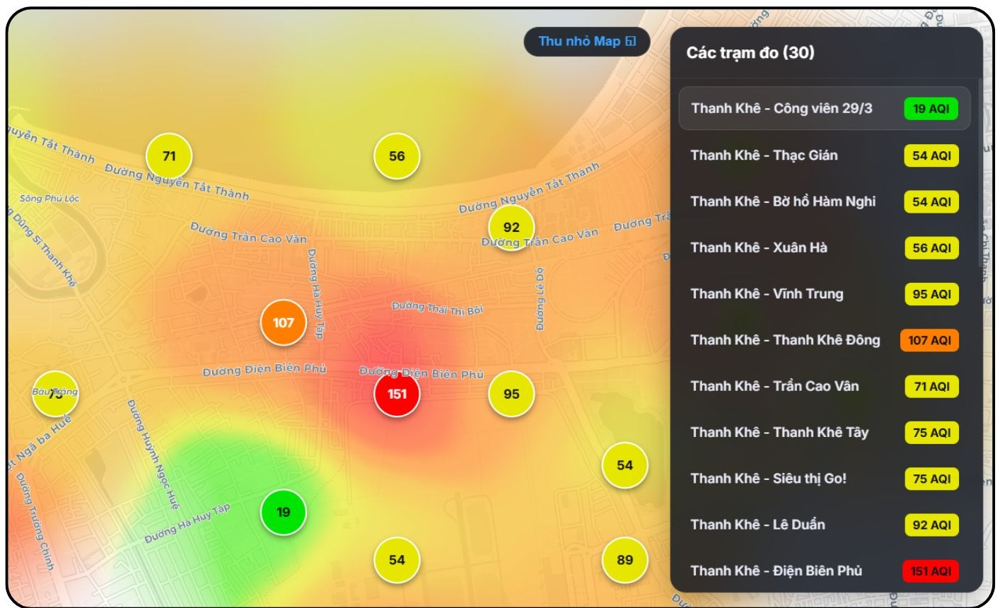

## Giới thiệu

Đây là hệ thống IoT giám sát chất lượng không khí theo kiến trúc **Master – Slave** với hai node ESP32 giao tiếp qua LoRa SX1278 433 MHz. Master chủ động polling Slave theo giao thức request/response có xác thực CRC8, đảm bảo tính toàn vẹn dữ liệu và giảm xung đột gói tin trong môi trường nhiễu.

Cả hai node đều chạy **TinyML (Edge Impulse)** để phân loại trạng thái môi trường ngay tại biên (FIRE / High_CO2 / Traffic / NORMAL / CHEMICAL), sau đó Master tổng hợp và đẩy dữ liệu lên **Supabase**. Dashboard **Next.js** hiển thị dữ liệu thời gian thực, vẽ heatmap bằng nội suy **IDW (Inverse Distance Weighting)** và cung cấp biểu đồ lịch sử, gauge AQI.

---

## Sơ đồ hệ thống

Sơ đồ dưới đây mô tả toàn bộ luồng xử lý của hệ thống, từ việc thu thập dữ liệu tại các node cảm biến, giao tiếp LoRa, phân loại TinyML, đến đẩy dữ liệu lên cloud và hiển thị trên dashboard.



---

## Phần cứng

### Hai Node Slave – Master

Ảnh dưới thể hiện phần cứng thực tế của cả hai node (Slave bên trái, Master bên phải), bao gồm ESP32, module LoRa Ra-02 SX1278 và các cảm biến môi trường.



### Node Master

| Linh kiện | Chức năng |
|---|---|
| ESP32 | Vi xử lý chính, WiFi, FreeRTOS dual-core |
| PMS7003 | Đo PM1.0 / PM2.5 / PM10 |
| CO2-C8 (UART) | Đo CO₂ thực |
| AHT40 (I²C) | Nhiệt độ & độ ẩm |
| LoRa SX1278 Ra-02 | Giao tiếp 433 MHz với Slave |

### Node Slave

| Linh kiện | Chức năng |
|---|---|
| ESP32 | Vi xử lý chính, FreeRTOS dual-core |
| PMS7003 | Đo PM1.0 / PM2.5 / PM10 |
| SGP30 (I²C) | Đo TVOC & eCO₂ |
| AHT40 (I²C) | Nhiệt độ & độ ẩm |
| LoRa SX1278 Ra-02 | Giao tiếp 433 MHz với Master |

---

## TinyML – Phân loại cảnh báo

Cả Master và Slave đều chạy mô hình **Edge Impulse** ngay trên chip ESP32 để phân loại trạng thái môi trường thành 4 nhãn: **FIRE**, **High\_CO2**, **Traffic**, **NORMAL**.

Confusion matrix dưới đây thể hiện độ chính xác của mô hình TinyML được triển khai:



- **Master model:** thư mục [`ei-master-node-lib`](ei-master-node-lib)
- **Slave model:** thư mục [`tuankaka-dev-project-1_inferencing`](tuankaka-dev-project-1_inferencing)

---

## Dashboard Web

Dashboard Next.js hiển thị dữ liệu từ Supabase theo thời gian thực với đầy đủ các thành phần: bản đồ vị trí trạm, gauge AQI, biểu đồ lịch sử, trạng thái TinyML và thông tin từng trạm.



---

## Giao diện nội suy IDW

Heatmap được vẽ bằng thuật toán **IDW (Inverse Distance Weighting)** trực tiếp trên canvas phủ lên Google Maps, giúp trực quan hóa phân bổ chất lượng không khí giữa các trạm đo.



---

## Tính năng

- ✅ Đo **PM1.0 / PM2.5 / PM10**, **CO₂ / eCO₂**, **TVOC**, **nhiệt độ**, **độ ẩm**
- ✅ Giao tiếp **LoRa SX1278 433 MHz** theo cơ chế polling request/response có xác thực **CRC8**
- ✅ Tách luồng xử lý bằng **FreeRTOS dual-core** để đọc sensor ổn định, không bị block bởi I/O mạng
- ✅ Phân loại cảnh báo tại biên bằng **TinyML (Edge Impulse)** trên cả hai node (FIRE, High_CO2, Traffic, NORMAL, CHEMICAL)
- ✅ Đẩy dữ liệu lên **Supabase** theo chu kỳ (mặc định 10 s)
- ✅ Dashboard web hiển thị **bản đồ nhiệt IDW**, AQI, biểu đồ lịch sử, trạng thái trạm
- ✅ Hỗ trợ **nhiều trạm** với tọa độ GPS, hiển thị realtime

---

## Cấu trúc thư mục

```
root/
├── airq-web/                           # Next.js dashboard (source)
├── Master-node.ino                     # Firmware Master ESP32
├── Slave-node.ino                      # Firmware Slave ESP32
├── ei-master-node-lib/                 # Edge Impulse model (Master)
├── tuankaka-dev-project-1_inferencing/ # Edge Impulse model (Slave)
├── supabase_schema.sql                 # Schema database chính
├── supabase_setup.sql                  # Setup bổ sung
└── seed.js / seed_vietnam.js           # Seed dữ liệu mẫu (tùy chọn)
```

---

```env
NEXT_PUBLIC_SUPABASE_URL=https://<project-ref>.supabase.co
NEXT_PUBLIC_SUPABASE_ANON_KEY=<anon-key>
```
